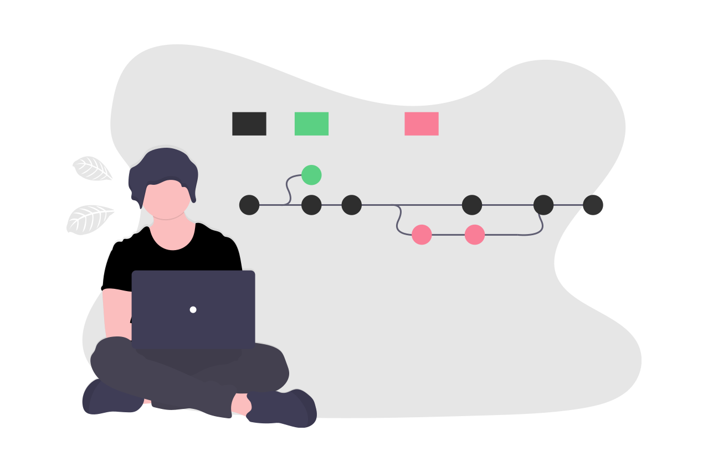

Olá :wave: me chamo André Almeida, sou Técnico de Informatica e amo desenvolver.

Atualmente trabalho como Analista de Sistemas na empresa [Alterdata Software](https://www.alterdata.com.br/). E estudo Ciência da Computação na [Feso](https://www.unifeso.edu.br/). Já faz alguns anos que trabalho na área de TI. É uma área que me fascina muito com sua potêncialização de resolver problemas atráves da criatividade e lógica, oque me motiva a estudar e crescer cada vez mais. 

:blue_book: Habilidades: HTML, CSS, JavaScript, Sass, Bootstrap, Java.

:wrench: Ferramentas: VSCode, Webpack, Figma, Git and Github.

💌 Se você deseja realizar um projeto comigo (ou bater papo), não hesite em me enviar uma mensagem: ⤵️

    

